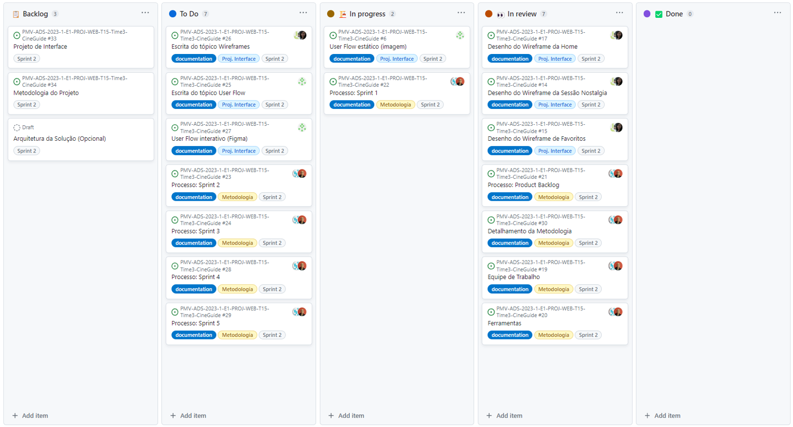

# **Metodologia**

A equipe utilizará o metodologia ágil para gestão de projetos de *software*, [*Scrum*](https://scrumguides.org/docs/scrumguide/v2020/2020-Scrum-Guide-US.pdf). Todavia, com adaptações para a realidade do projeto. Portanto, as principais definições são:
- As *sprints* serão realizadas a partir do *product backlog* eterão duração de 2 a 3 semanas.
- Toda semana haverá uma cerimônia (*weekly meeting*) ao invés de reuniões diárias (*daily scrum*/*daily meeting*. 
  - A *weekly meeting* de abertura da *sprint* terá o objetivo de abordar as estórias (tarefas) a serem realizadas na *sprint* atual e aquelas que deveram ser concluídas até a próxima *weekly meeting*;
  - As *weekly meeting* terão os seguintes objetivos:
    - Identificar o que foi feito na semana anterior;
    - Identificar se houveram impedimentos;
    - Replanejar as estórias que forem necessárias;
    - Mapear o que será feito até a próxima semana;
    - Propor melhorias naquilo que já foi feito até então.
- A *Sprint Retrospective* será realizada ao final de cada *sprint* e terá o objetivo de encontrar pontos a serem melhorados na metodologia. Logo, durante a reunião o time irá discutir:
  - O que deu certo na *sprint*;
  - O que poderia ser melhorado;
  - O que o time se comprometerá a melhorar na próxima *sprint*.
- A *Sprint Review Meeting* será realizada ao final da *sprint* quando demandado pelo professor orientador/facilitador.

## **Equipe de Trabalho**

Os papéis *Scrum* foram divididos da seguinte forma:
- *Product Owner*: 
  - Eduardo Gonçalves Sena.
- *Scrum Master*: 
  - Marcelo Vinicius Assis de Brito.
- *Developers*: 
  - Bárbara Laura Tavares;
  - Breno Augusto França da Silva;
  - Igor Polatschek; 
  - Stefany Barbosa Ribeiro.

## **Ferramentas**

O desenvolvimento deste projeto foi facilitado pelo uso das seguintes ferramentas:

Finalidade                                          | Ferramenta
--------------------------------------------------- |----------------------------- 
Hospedagem do código-fonte                          | [GitHub](https://github.com/ICEI-PUC-Minas-PMV-ADS/PMV-ADS-2023-1-E1-PROJ-WEB-T15-Time3-CineGuide/tree/main/src)
Hospedagem da documentação                          | [GitHub](https://github.com/ICEI-PUC-Minas-PMV-ADS/PMV-ADS-2023-1-E1-PROJ-WEB-T15-Time3-CineGuide/tree/main/docs)
Gerenciamento do projeto                            | [GitHub Projects](https://github.com/orgs/ICEI-PUC-Minas-PMV-ADS/projects/355)
Criação dos *wireframes* e do *userflow* interativo | [Figma](https://www.figma.com/proto/v1QlDU5F5g4dYkHxDsKStI/Wireframes_proj_cine_guide_ADS_PUC_E1?node-id=187-140&scaling=contain&page-id=0%3A1&starting-point-node-id=187%3A140)
Criação do *userflow* estático                      | [Figma](https://www.figma.com/proto/v1QlDU5F5g4dYkHxDsKStI/Wireframes_proj_cine_guide_ADS_PUC_E1?node-id=187-140&scaling=contain&page-id=0%3A1&starting-point-node-id=187%3A140) e <mark>**ADD_OUTRA_FERRAMENTA**</mark>
Comunicação assíncrona              | *WhatsApp*
Comunicação síncrona                | *Microsoft Teams*
Edição de código e texto            | *Visual Studio Code*
Servidor de hospedagem              | <mark>**A definir**</mark>

## **Processo**

### **Product Backlog**

A priorização do *product backlog* foi realizada seguindo o cronograma do Projeto da disciplina. Portanto, cada etapa coincide com uma *sprint* e os entregáveis de cada etapa também são os entregáveis de cada *sprint*, conforme a tabela abaixo.

Sprint   | Etapa da Disciplina                                         | Entregável/Artefato 
-------- | ----------------------------------------------------------- | -----------------
1        | [Etapa 1 - Análise do problema e especificação de requisitos](https://pucminas.instructure.com/courses/150446/pages/etapa-1-analise-do-problema-e-especificacao-de-requisitos) | <ul><li>Documentação do Projeto;</li><li>Especificação do Projeto;</li><li>Apresentação do Projeto.</li></ul>
2        | [Etapa 2- Projeto da solução](https://pucminas.instructure.com/courses/150446/pages/etapa-2-projeto-da-solucao) | <ul><li>Metodologia;</li><li>Projeto de Interface;</li><li>Arquitetura de Solução (opcional).</li></ul>
3        | [Etapa 3 - Desenvolvimento da solução - Parte 1](https://pucminas.instructure.com/courses/150446/pages/etapa-3-desenvolvimento-da-solucao-parte-1) | <ul><li>Template Padrão do Site;</li><li>Programação de Funcionalidades.</li></ul>
4        | [Etapa 4 - Desenvolvimento da solução - Parte 2](https://pucminas.instructure.com/courses/150446/pages/etapa-4-desenvolvimento-da-solucao-parte-2) | <ul><li>Programação das demais Funcionalidades;</li><li>Plano de Testes de Software;</li><li>Registro de Testes de Software.</li></ul>
5        | [Etapa 5 - Implantação e apresentação da solução](https://pucminas.instructure.com/courses/150446/pages/etapa-5-implantacao-e-apresentacao-da-solucao) | <ul><li>Implantação da Solução;</li><li>Apresentação do Projeto;</li><li>Vídeo de Demonstração da Solução.</li></ul>

### **Sprint 1**

#### **Planejamento**

##### Estórias da Documentação do Projeto

Estória/Tarefa             | Responsável       | Prazo
-------------------------- | ----------------- | ------------
Introdução                 |                   |
Problema                   |                   |  
Objetivos                  |                   | 
Justificativa              |                   | 
Público-Alvo               |                   | 

##### Estórias da Especificação do Projeto
Estória/Tarefa             | Responsável       | Prazo
-------------------------- | ----------------- | ------------
Especificações do Projeto  |                   | 
Personas                   |                   | 
Histórias de Usuários      |                   | 
Requisitos                 |                   | 
Requisitos Funcionais      |                   |
Requisitos não Funcionais  |                   | 
Restrições                 |                   | 

#### **Execução**

 Tarefa | Responsável |
|--- |--- |
| Documentação de Contexto | Fulano Beltrano  |
| Especificação do Projeto | Ciclano |

#### **Evidências**

- Links:
  - [Link 1](https://google.com.br);
  - [Link 2](https://google.com.br);

### **Sprint 2**

Tarefas:

#### **Planejamento**

#### **Execução**

| Tarefa | Responsável |
|--- |--- |
| Documentação de Contexto | Fulano Beltrano  |
| Especificação do Projeto | Ciclano |

#### **Evidências**

- Links:
  - [Link 1](https://google.com.br);
  - [Link 2](https://google.com.br);

>**INFO**
><mark> A partir da sprint 3, só colocamos os entregáveis da etapa/sprint </mark>

### **Sprint 3**

#### **Planejamento**

#### **Execução**

| Tarefa | Responsável |
|--- |--- |
| Documentação de Contexto | Fulano Beltrano  |
| Especificação do Projeto | Ciclano |

#### **Evidências**

- Links:
  - [Link 1](https://google.com.br);
  - [Link 2](https://google.com.br);

### **Sprint 4**

#### **Planejamento**

Imagem Kanban

#### **Execução**

| Tarefa | Responsável |
|--- |--- |
| Documentação de Contexto | Fulano Beltrano  |
| Especificação do Projeto | Ciclano |

#### **Evidências**

- Links:
  - [Link 1](https://google.com.br);
  - [Link 2](https://google.com.br);

### **Sprint 5**

Tarefas:

#### **Planejamento**

Imagem Kanban

#### **Execução**

| Tarefa | Responsável |
|--- |--- |
| Documentação de Contexto | Fulano Beltrano  |
| Especificação do Projeto | Ciclano |

#### **Evidências**

- Links:
  - [Link 1](https://google.com.br);
  - [Link 2](https://google.com.br);
