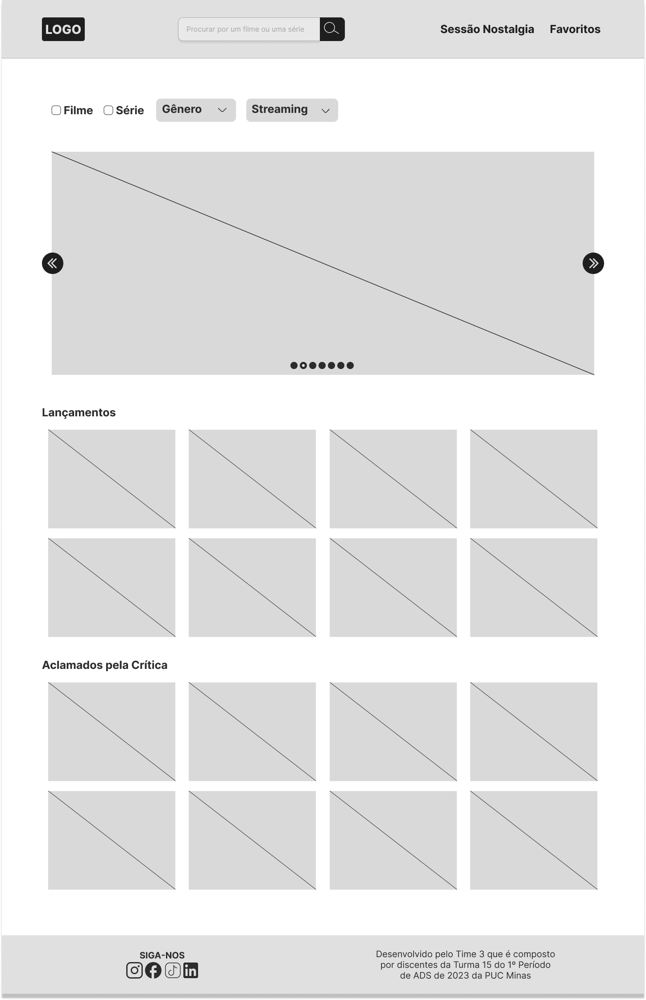
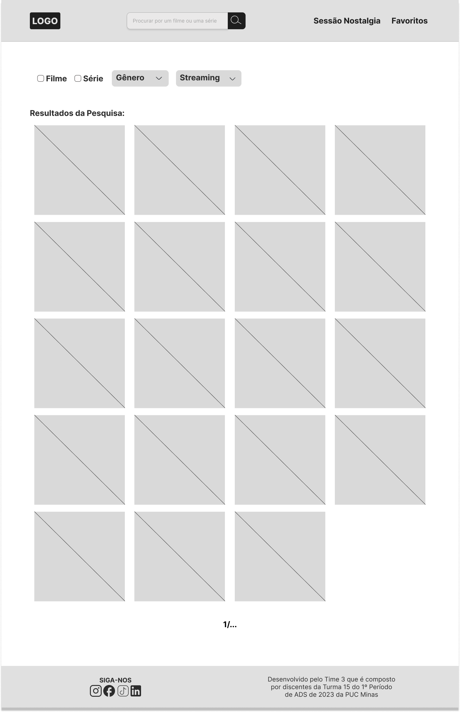
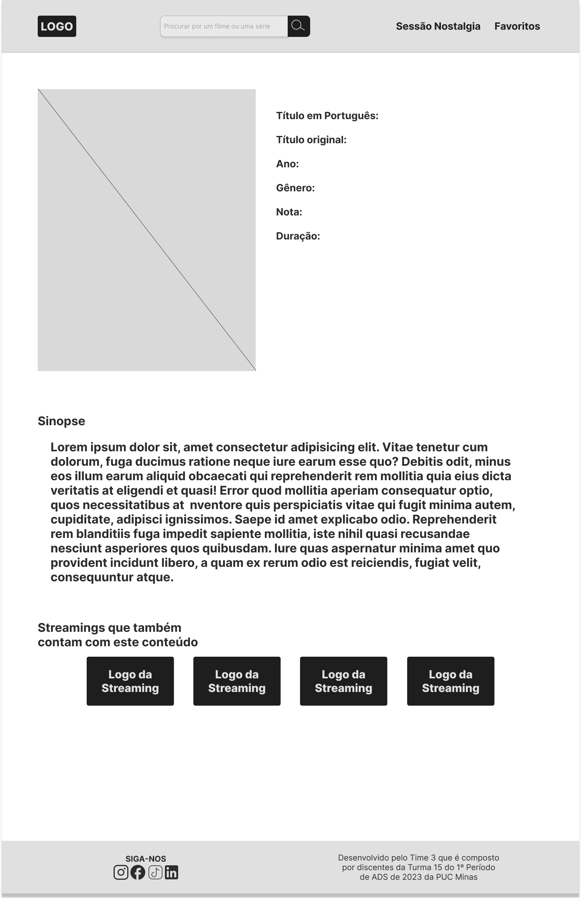
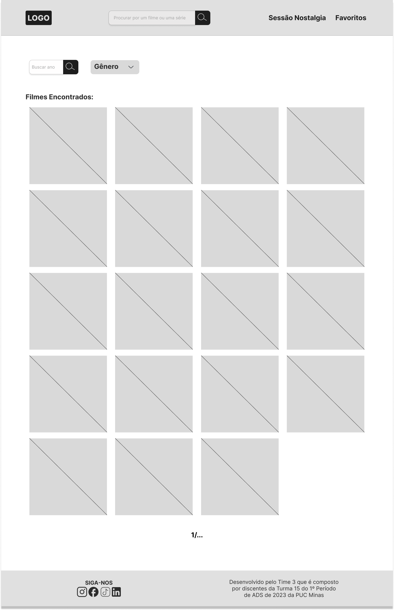
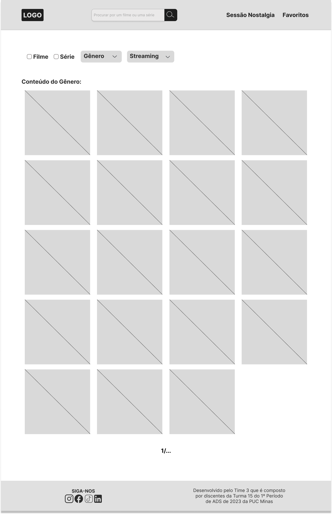
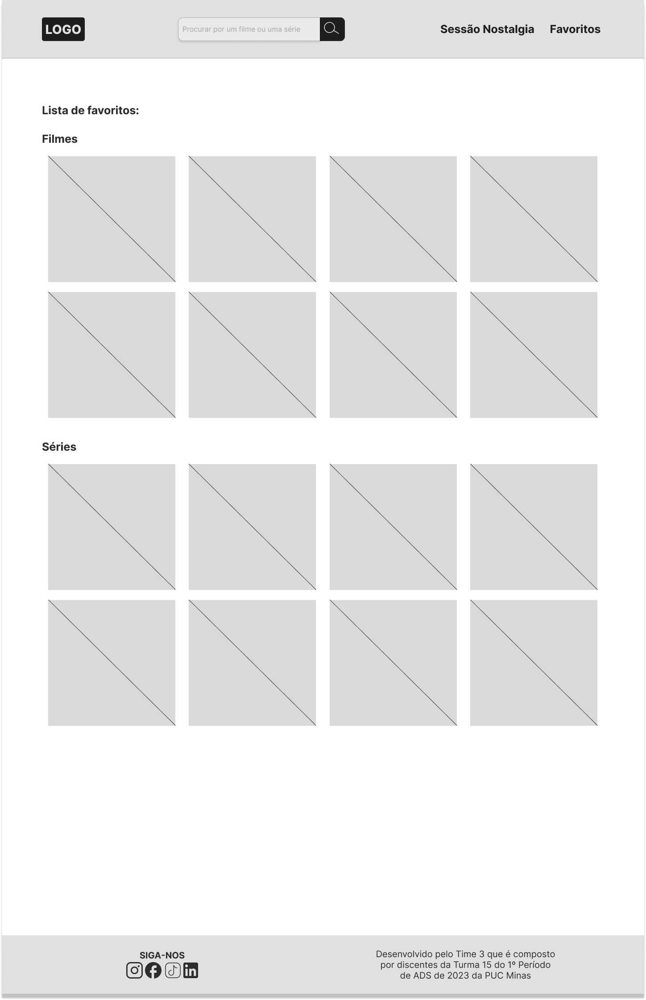

# **Projeto de Interface**

O projeto de interface aqui proposto tem como princípios a simplicidade e a usabilidade. Isso, é viabilizado por uma interface minimalista e padronizada entre as diferentes telas. Estas serão projetadas para permitir uma boa experiência de uso tanto em *desktops* quanto em dispositivos móveis.

## **Fluxo do usuário**

O fluxo do usuário (*user flow*) dentro da aplicação pode ser visualizado no esquema abaixo ou no [*user flow* interativo](https://www.figma.com/proto/v1QlDU5F5g4dYkHxDsKStI/Wireframes_proj_cine_guide_ADS_PUC_E1?node-id=187-140&scaling=contain&page-id=0%3A1&starting-point-node-id=187%3A140). Em ambos, é possível compreender como ocorre a interação do usuário com a interface do projeto CineGuide.

## ***Wireframes***

## ***Home page***
Ao acessar a *home page* o usuário pode realizar buscas por meio da: 
- Caixa de pesquisa;
- Filtros (tipo de conteúdo: filme ou série, gênero, *streaming*);
- Sessão nostalgia;
- Favoritos.

Além disso, haverá uma sessão de conteúdos que são lançamentos e outra de conteúdos bem avaliados por críticos, conforme a figura abaixo.

## **Resultado da caixa de pesquisa**

Uma vez que o usuário faça uma busca, será exibida uma tela com uma lista *cards* dos conteúdos  (filmes ou séries) correspondentes à busca realizada (segue abaixo). 

## ***Card page***

Ao clicar em um filme ou série presente em qualquer página, ocorrerá o redirecionamento para a *card page* (Figura que segue abaixo), onde serão exibidas as seguintes informações do conteúdo:
- Título (português e original);
- Ano de laçamento;
- Gênero;
- Nota;
- Duração;
- Sinopse; 
- indicação de outras streamings que podem contam com o conteúdo.

## **Resultado do filtro de filme**

Na 4ª tela, se o usuário desejar buscar filmes utilizando filtros, ele pode clicar em "Filtro de Filmes" na home. Na página do filtro, o usuário pode selecionar opções como: gênero, *streaming*, ou mudar para a página de séries clicando em séries dentro dessa mesma página. Ao selecionar uma opção, o site apresenta ao usuário uma lista de filmes que correspondem ao filtro selecionado.

## **Resultado do filtro de série**

Como é apresentado na 5ª tela vemos que se o usuário desejar buscar séries, ele pode clicar em "Filtro de Séries" na *home*. Na página do filtro de séries, o usuário pode selecionar opções como: gênero, streaming, ou mudar para a página de filmes clicando em filmes dentro dessa mesma página. Ao selecionar uma opção, o site apresenta ao usuário uma lista de séries que correspondem ao filtro selecionado.

## **Sessão de nostalgia**

Já na 6ª tela, se o usuário desejar acessar a sessão de nostalgia, ele pode clicar em "Sessão Nostalgia" na home. Na página da sessão nostalgia, o usuário encontra uma lista de filmes antigos e clássicos.

## **Resultado da seleção de um gênero**

Na 7ª tela, se o usuário desejar buscar filmes por gênero, ele pode clicar em "Seleção de Gênero" na home.
Na página de seleção de gênero, o usuário pode escolher um gênero de sua preferência, como: ação, comédia, drama, entre outros. Ao selecionar um gênero, o site apresenta ao usuário uma lista de filmes que correspondem ao gênero selecionado.

## **Resultado da seleção de uma *streaming***

Na 8ª tela, se o usuário desejar buscar filmes por *streaming*, ele pode clicar em "Seleção de *Streaming*" na home. Na página de seleção de *streaming*, o usuário pode escolher um serviço de *streaming* de sua preferência, como: Netflix, Amazon Prime Video, entre outros. Ao selecionar um serviço de *streaming*, o site apresenta ao usuário uma lista de filmes disponíveis no serviço de *streaming* selecionado.

## **Página de Favoritos**

Por fim, na 9ª e última tela, o usuário pode salvar seus filmes favoritos clicando em "Favoritos" na home.
Na página de favoritos, o usuário pode encontrar todos os filmes que salvou como favoritos e acessá-los facilmente.

